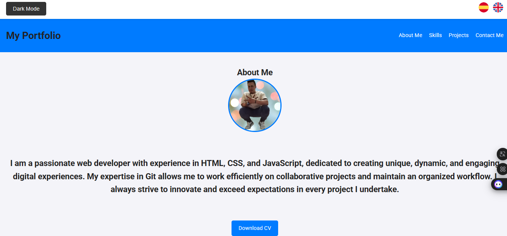
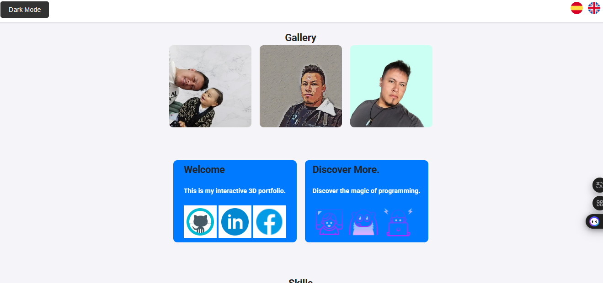
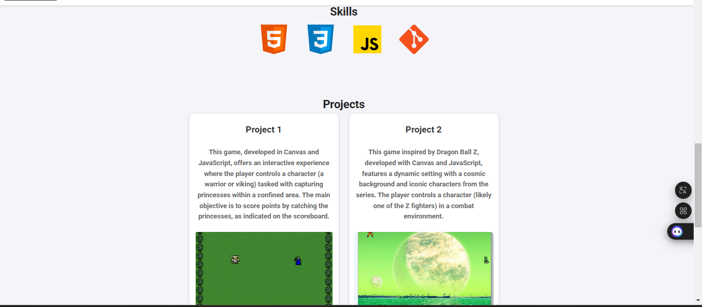
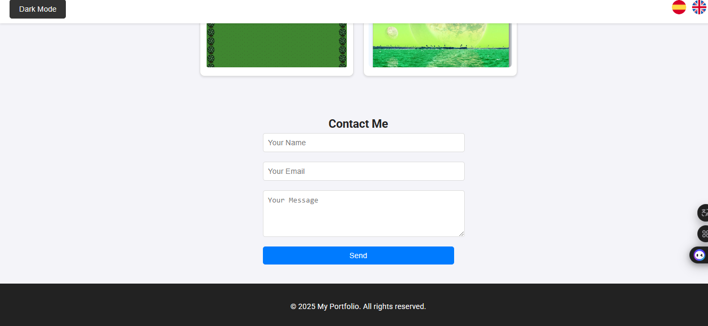

# Portafolio 3D Interactivo

Este es un portafolio personal en 3D diseñado para mostrar mis habilidades, proyectos y experiencia profesional y aprendizaje de una manera única e interactiva. El proyecto utiliza **HTML5, CSS3, JavaScript y un toque o inicio de THREE.js** para darle el texturizado en 3D del cual investigue un poco para crear ese entorno tridimensional he inmersivo donde los visitantes pueden explorar mi trabajo.

## Características

- **Diseño en 3D**: Un entorno completamente tridimensional que incluye elementos interactivos como modelos, animaciones y transiciones suaves.
- **Interactividad**: Todos pueden navegar por el portafolio utilizando el mouse o el teclado.
- **Secciones personalizables**: Incluye áreas dedicadas para:
  - Presentación personal.
  - Proyectos destacados.
  - Habilidades técnicas.
  - Información de contacto.
- **Tecnologías utilizadas**:
  - Three.js: Para renderizar gráficos en 3D.
  - HTML5 y CSS3: Para la estructura y el diseño.
  - JavaScript: Para la lógica e interactividad.

## Instalación

Sigue estos pasos para ejecutar el portafolio en tu máquina local:

1. Clona este repositorio:

   ```bash
   git clone https://github.com/Metazack89/portafolio-3d.git
   ```

2. Navega a la carpeta del proyecto:

   ```bash
   cd portafolio-3d
   ```

3. Instala un servidor local (por ejemplo, con **Live Server** o **http-server**):

   - Si usas **http-server**, instálalo con:
     ```bash
     npm install -g http-server
     ```
   - Luego ejecuta:
     ```bash
     http-server
     ```

4. Abre el proyecto en tu navegador en `http://localhost:8080`.

## Uso

- **Navegación**: Usa el mouse para explorar el entorno.
- **Interacción**: Haz clic en los elementos interactivos para obtener más información sobre cada sección.
- **Proyectos**: Explora los proyectos destacados en los modelos o tarjetas.

## Capturas de Pantalla

__   

## Contribuciones

Si deseas contribuir al proyecto:

1. Haz un fork del repositorio.
2. Crea una nueva rama:
   ```bash
   git checkout -b mi-rama
   ```
3. Realiza tus cambios y haz un commit:
   ```bash
   git commit -m "Descripción de los cambios"
   ```
4. Envía un pull request.

## Licencia

Este proyecto está bajo la licencia MIT. Consulta el archivo `LICENSE` para más detalles.

## Créditos

- Diseñado y desarrollado por [Cristian Ortiz].
- Agradecimientos a Academlo y Alejandra Olazagasti por ser una gran educadora y mentora gracias a ella esto no hubiera sido posible.
- Inspirado en las tendencias modernas de portafolios interactivos.

## Contacto

Si tienes preguntas o sugerencias, no dudes en contactarme:

- **Correo**: [dcjstyles@gmail.com]
